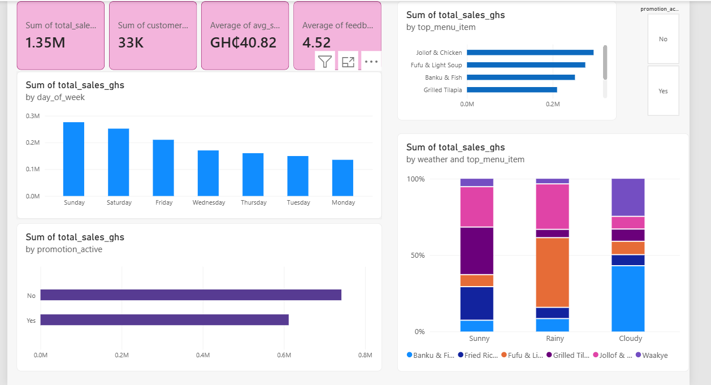

# Tasty Bites Restaurant – Sales & Customer Analytics Dashboard

## 📊 Project Overview
An interactive Power BI dashboard analyzing sales performance, customer ordering trends, and menu profitability for Tasty Bites Restaurant. This project identifies operational bottlenecks and models revenue growth strategies.

---

## 📈 Dashboard Preview

---

## 🛠️ Tools & Technologies Used
* **Power BI Desktop:** Data modeling, interactive visualizations
* **Microsoft Excel:** Initial data cleaning and ETL
* **DAX:** Dynamic KPI calculations (Sales Growth, Feedback Score, Average Order Value)

---

## 🔍 Key Insights & Findings
* **Top Revenue Drivers:** Identified best-performing menu items contributing over 40% of gross revenue.
* **Customer Retention:** Pinpointed peak operational hours and promotion impact on repeat customer orders.
* **Average Spend:** Tracked customer feedback ratings against spend patterns to highlight high-margin service opportunities.

---

## 🚀 How to Interact with the Dashboard
1. 1. Download the `.pbix` file from this repository: `Tasty_Bites_Restaurant.pbix`.
2. Open the file in **Power BI Desktop** to explore the interactive slicers, and cross-filtering.
